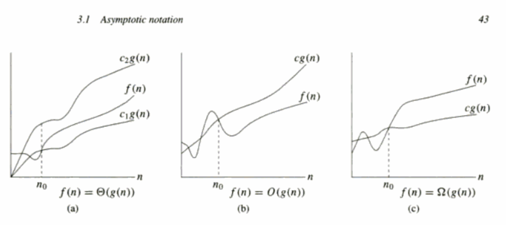

## Asymptotic notation
  
Asympototic notations are used to describe the running times of algorithms, it actually applies to 3 functions:
1. Ω(g(n)) - big omega of g(n)
2. Θ(g(n)) - theta of g(n)
3. O(g(n)) - big oh of g(n)

#### Ω(g(n))
Ω notation provides an **asymptotic lower bound**:  
>Ω(g(n)) = {  f(n): there exist positive constants c and n0 such that  0 <= cg(n) <= f(n) for all n >= n0  }
#### Θ(g(n))
Θ notation provides an **asymptotic tight bound**:  
>Θ(g(n)) = {f(n): there exist positive constants c1, c2 and n0 such that 0 <= c1*g(n) <= f(n) <= c2*g(n) for all n >= n0 }
#### O(g(n))
O notation provides an **asymptotic upper bound**:
>O(g(n)) = {f(n): there exist positive constants c and n0 such that 0 <= f(n) <= c*g(n) for all n >= n0 }  
#### Comparing functions
>f(n) = O(g(n)) is f(n) <= g(n)
>f(n) = Ω(g(n)) is f(n) >= g(n)
>f(n) = Θ(g(n)) is f(n) = g(n)